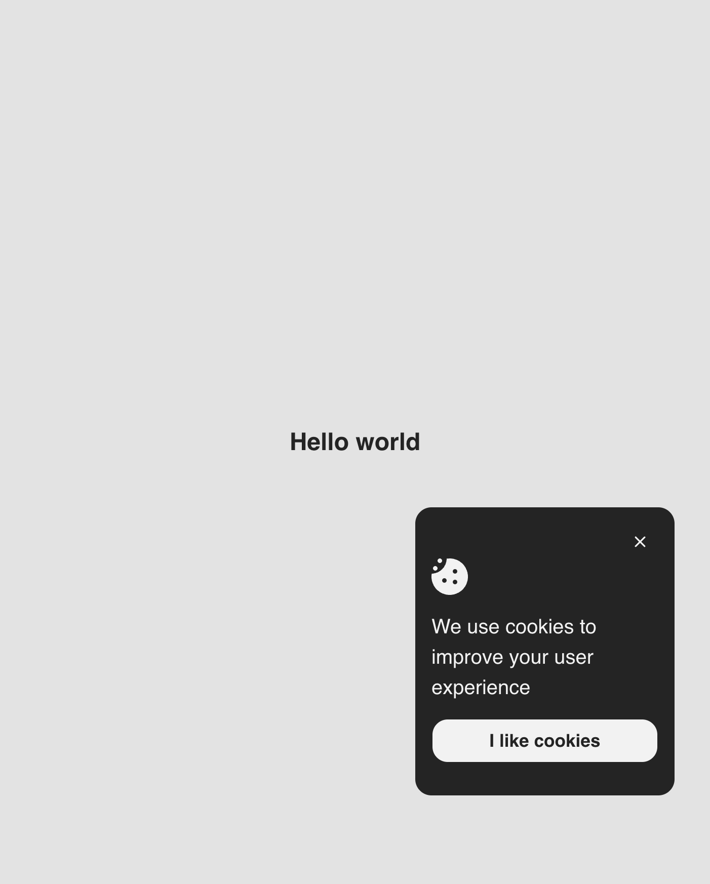

# Tabs section

This is a simple Cookie consent banner that allows users to accept or reject cookies on a website. It is built using HTML, CSS, and vanilla TypeScript.
This project is a solution to the roadmap task "Cookie Consent" in the "Frontend Developer" roadmap of the "Web Developer" roadmap on [roadmap.sh](https://roadmap.sh/frontend).
You can find this project page [here](https://roadmap.sh/projects/cookie-consent).

## Table of Contents

- [Screenshot](#screenshot)
- [Requirements](#requirements)
- [Technologies](#technologies)
- [Installation](#installation)
- [Build](#build)
- [Usage](#usage)

## Screenshot

## Requirements
- Node.js [Download](https://nodejs.org)
- npm or yarn or pnpm (optional) [npm](https://www.npmjs.com/get-npm) [yarn](https://yarnpkg.com/getting-started/install) [pnpm](https://pnpm.io/installation)

## Technologies
- Vite
- TypeScript
- HTML
- CSS

## Installation
1. Clone the repository.  
2. Install dependencies by executing the command `npm install` or `yarn` or `pnpm install`. 
3. Start development server with `npm run dev` (or use any other package manager).
4. Open the local server in a browser.

## Build
To build the project, run the command `npm run build` (or use any other package manager). The build files will be generated in the `dist` directory.

## Usage
1. Open the local server in a browser, by default the local server runs on `http://localhost:5173`.
2. You will see the cookie consent banner at the bottom of the page.
3. You can accept the cookies by clicking the "I like cookies" button, a variable 'cookie-consent' will be set to 'true' in the local storage, and the banner will be hidden.
4. You can reject the cookies by clicking the "X" button to close the banner, a variable 'cookie-consent' will be set to 'false' in the local storage, and the banner will be hidden.

**NOTE**: The cookie consent banner will not be shown again if you have already accepted or rejected the cookies. You can clear the local storage to see the banner again.